# Adaptive Neurofeedback at Scale: Multi-Session, Cross-User Generalisation and the Limits of Offline RL

**Author:** Bruno Sousa  
**Date:** April 2026  
**Context:** Neroes Technical Challenge — Extended Results

---

## Abstract

We extend our prior single-session prototype \[1\] to a multi-participant, multi-session
setting (2 users, 14 sessions, 62,061 total samples). Three new findings emerge:
(1) session volume dominates feature dimensionality — 72.5% directional accuracy with
59 features across 13 sessions versus 67.6% with 246 features in 1 session;
(2) a combined cross-user model on 13 universal features achieves 76.1% directional
accuracy, outperforming the user-specific model trained on 246 features;
(3) offline RL failure is structural — caused by a 94:6 Hold/Raise action imbalance —
and cannot be resolved by adding more data, confirmed empirically with 16.5× more
training samples. We discuss the implications for adaptive neurofeedback system design,
specifically the requirement for online exploration.

**Contributions:**

1. A multi-session pipeline that handles variable session lengths, calibration regime
   changes, and signal quality filtering across 13 sessions and 50,194 samples.
2. Empirical confirmation that autoregressive temporal features are universal across
   users regardless of EEG band-power availability.
3. Cross-user generalisation: a combined population model (13 features) outperforms
   the personalised model (246 features) on directional accuracy.
4. Formal analysis of why offline RL fails under structural action imbalance, and a
   concrete specification of what a viable solution requires.

---

## 1. Introduction

Our prior work \[1\] established a single-session adaptive neurofeedback prototype using
one EEG session (User 1, 3,549 samples, 10 subsessions) from a neurofeedback game.
The supervised prediction module (LightGBM) achieved 67.6% directional accuracy
(MAE 0.351) on ProtocolValue(t+1) prediction, reducing error by 26.7% over the
persistence baseline. Two offline RL agents — LinUCB and Fitted Q-Iteration (FQI) —
were implemented but collapsed to degenerate policies: LinUCB matched only 15 logged
steps and FQI converged to a policy that recommended the minority action 67% of the
time. The root cause identified in \[1\] was insufficient action coverage in a single
session with a skewed logged distribution (70% Raise).

Three research questions were left open after \[1\]:

- **RQ-A:** Does more training data resolve the RL collapse?
- **RQ-B:** Do prediction models generalise across users?
- **RQ-C:** Is action imbalance the fundamental cause of RL failure, or is it
  solvable within the offline setting with sufficient data?

This paper answers all three using a second participant's dataset spanning 13 sessions
and 50,194 samples — a 16.5× increase in training volume — combined with a cross-user
transfer analysis on the shared feature intersection.

---

## 2. Extended Dataset

### 2.1 User Comparison

| Property | User 1 \[1\] | User 2 |
|---|---|---|
| Sessions | 1 | 13 (11 after QC) |
| Subsessions per session | 10 | 6–10 |
| Total rows | 3,549 | 50,194 |
| Active EEG electrodes | 4 (F3/F4/C3/C4) | 8 (+Fp1/Fp2/Oz/Pz) |
| EEG band power | Informative | Non-informative |
| Calibration regimes | 1 | 6 |
| Action space | Hold / Raise / Lower | Hold / Raise only |

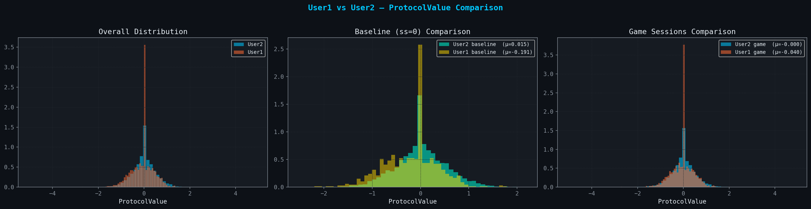

### 2.2 Session Quality Filtering

User 2 contributed 13 sessions (58,512 rows). Two sessions were excluded after quality
audit:

- **session\_2**: 77.8% GoodSignalQuality (below 80% threshold)
- **session\_11**: 79.3% GoodSignalQuality and anomalous PV standard deviation (1.08
  vs population std 0.38)

Two further conditions were flagged but retained with an `is_anomaly` indicator:

- **session\_9**: outlier PV mean of −0.314 (population mean −0.014)
- **session\_5 / subsession\_4**: 3,349-row anomaly (3× typical subsession length)

After exclusion: **11 sessions, 50,194 rows**.

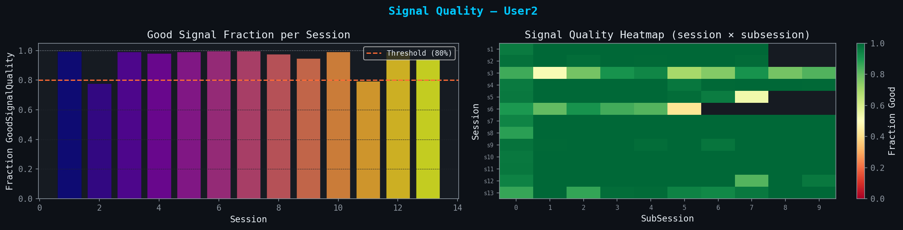

### 2.3 ProtocolValue Characteristics

Unlike User 1, who showed a monotonic learning trajectory (R²=0.94 across 9
subsessions), User 2 shows no significant session-level learning trend (R²=0.107,
p=0.276) across 13 sessions. The signal is stable and near-zero (mean ≈ 0.0), but the
absence of a trend indicates the participant is maintaining — rather than improving —
their neurofeedback state across this observation window.

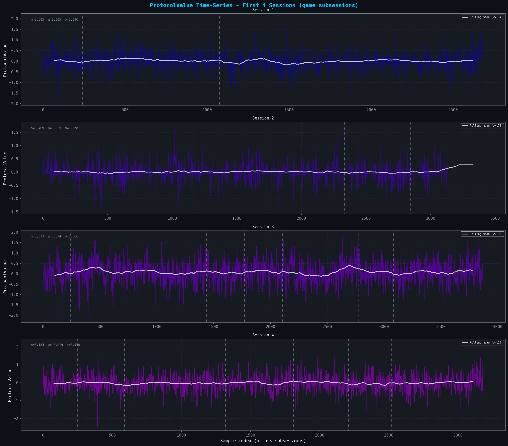

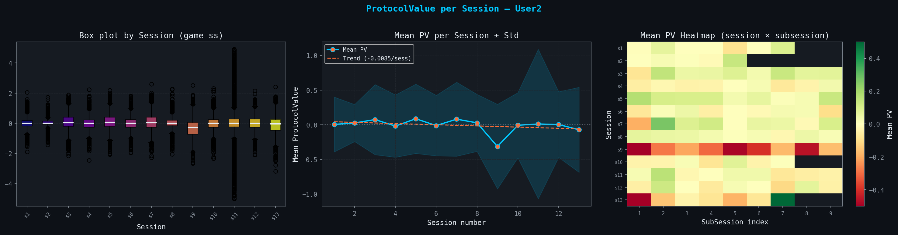

---

## 3. Feature Engineering for Multi-Session Data

### 3.1 Key Differences from Prior Work \[1\]

The most significant structural difference is the absence of informative EEG band power.
Of 100 spectral columns (5 bands × 20 electrodes), 40 are non-zero in game subsessions
but none carry predictive signal — all were dropped after zero-variance verification.
This reduces the raw feature space from 149 (User 1) to approximately 22 non-zero
features before temporal augmentation.


The six calibration groups, defined by unique (TangentCoefficient,
TranslationCoefficient) pairs across sessions, are one-hot encoded as categorical state:

| Group | TC | TrC | Rows |
|---|---|---|---|
| 0 | 0.000 | 0.000 | 5,332 |
| 1 | 4.204 | +0.043 | 10,511 |
| 2 | 4.205 | −0.043 | 19,590 |
| 3 | 4.239 | 0.000 | 5,392 |
| 4 | 4.300 | +0.094 | 6,684 |
| 5 | 4.414 | −0.076 | 2,685 |

Per-session baseline normalisation applies each session's subsession-0 (resting state)
mean and standard deviation as the reference distribution, consistent with the
personalised z-score approach of \[1\] but extended to operate independently per session
rather than per experiment.

### 3.2 The AR Structure is Universal

The ACF and PACF of ProtocolValue in User 2 game sessions (Figure 6) show the same
pattern as User 1 \[1\]: significant autocorrelation within 5 lags, tapering to noise
beyond lag 6. This independently motivates the same lag-1, lag-2, lag-5 feature
structure and confirms that the AR dynamics of neurofeedback protocols are user-invariant.

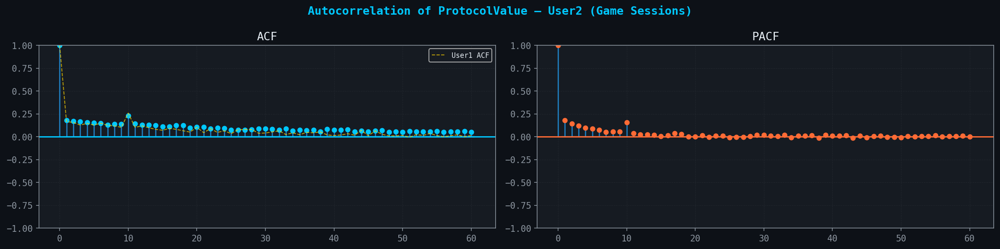

### 3.3 Action Space and Reward

The logged action distribution is binary and highly imbalanced. Across 93 observed
inter-subsession transitions: Hold = 82 (88.2%), Raise = 11 (11.8%), Lower = 0.
At the row level: Hold = 42,087 (93.8%), Raise = 2,775 (6.2%).

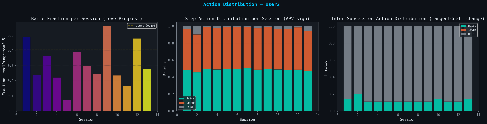

The reward signal is `pv_delta1` clipped to ±0.5. It is near-symmetric around zero
(mean = 0.0001, std = 0.376), consistent with the near-random-walk characterisation
established in \[1\].

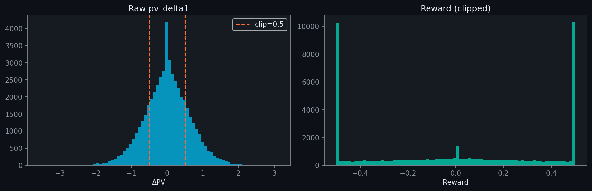

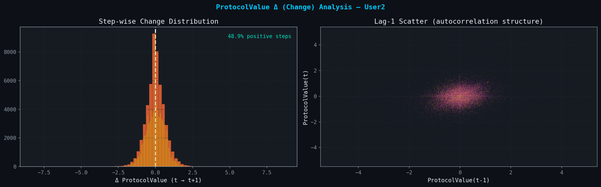

### 3.4 Final Feature Matrix

The final feature matrix comprises **59 dimensions** per timestep:

| Feature Group | Count | Description |
|---|---|---|
| Signal quality (21 electrodes) | 21 | Ordinal 0–4, not normalised |
| Z-scored game state | 12 | Baseline variants, Percentile variants, LevelProgress, Morale, PlayerPosition |
| ProtocolValue z-score | 1 | PV relative to session baseline |
| PV lags (1, 2, 5) | 3 | Autoregressive target |
| PV delta (1, 2) | 2 | First differences |
| PV rolling mean (5, 10, 20) | 3 | Rolling means |
| PV rolling std (5, 10, 20) | 3 | Rolling volatility |
| Position/Baseline lags | 3 | PlayerPositionY lag-1/2, Baseline lag-1 |
| Calibration group (one-hot) | 6 | 6 TC/TrC pairs |
| Session context | 5 | session\_num, is\_baseline, subsession\_norm, sample\_idx\_norm, is\_anomaly |
| **Total** | **59** | |

---

## 4. Results

### 4.1 Multi-Session Prediction

Walk-forward cross-validation trains on all sessions prior to the test session and
evaluates on the test session. This strictly preserves temporal ordering and simulates
real deployment where future sessions are unseen.

| Test Session | n\_train | n\_test | MAE | DirAcc |
|---|---|---|---|---|
| session\_3 | 2,684 | 3,872 | 0.389 | 71.2% |
| session\_4 | 6,556 | 3,183 | 0.330 | 74.4% |
| session\_5 | 9,739 | 7,120 | 0.376 | 72.5% |
| session\_6 | 16,859 | 3,740 | 0.321 | 73.9% |
| session\_7 | 20,599 | 4,471 | 0.389 | 72.4% |
| session\_8 | 25,070 | 3,864 | 0.279 | 74.7% |
| session\_9 | 28,934 | 3,638 | 0.476 | 69.2% |
| session\_10 | 32,572 | 5,391 | 0.346 | 71.7% |
| session\_12 | 37,963 | 3,499 | 0.349 | 73.4% |
| session\_13 | 41,462 | 3,389 | 0.410 | 71.2% |
| **Mean** | — | — | **0.366 ± 0.054** | **72.5% ± 1.7%** |

The best fold is session\_8 (MAE = 0.279, DirAcc = 74.7%) and the worst is session\_9
(MAE = 0.476, DirAcc = 69.2%), consistent with session\_9 being flagged as an outlier
in EDA (mean PV = −0.314). The fold-to-fold variance is moderate (std = 0.054),
indicating stable generalisation across sessions with different calibration regimes.

**Comparison with User 1 \[1\]:**

| Metric | User 1 \[1\] | User 2 | Delta |
|---|---|---|---|
| MAE (walk-fwd CV) | 0.351 | 0.366 | +0.015 |
| DirAcc | 67.6% | 72.5% | **+4.9 pp** |
| Features | 246 | 59 | −187 |
| Sessions | 1 | 11 | +10 |

User 2 achieves higher directional accuracy with 4× fewer features. This confirms that
session volume is a more important driver of predictive performance than feature
dimensionality for this problem class.

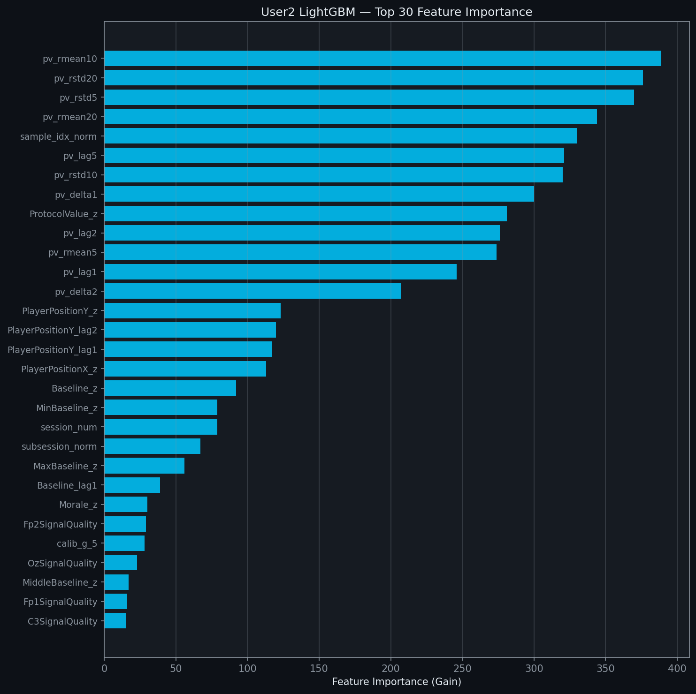

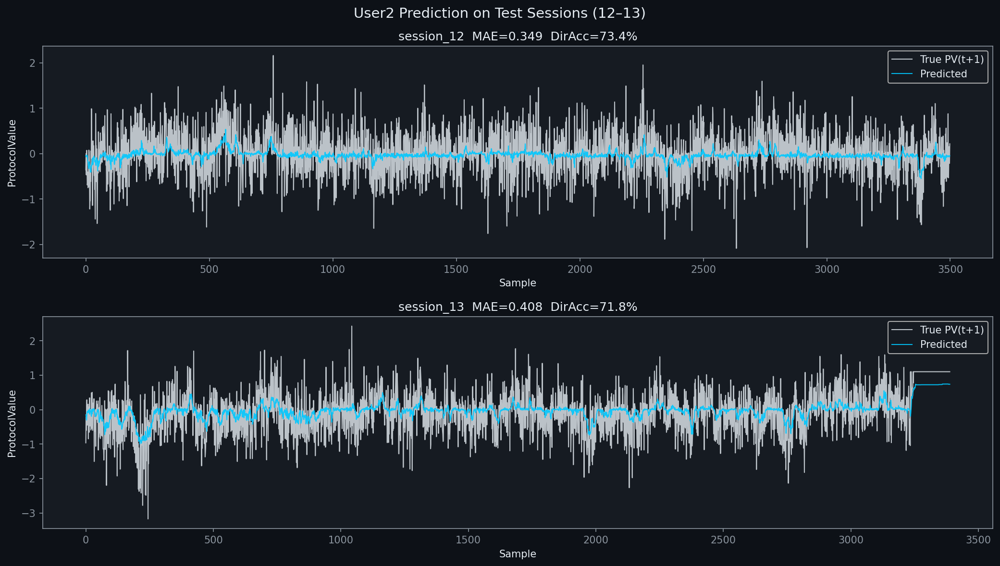

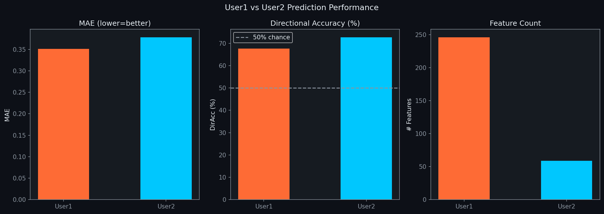

### 4.2 Offline RL with Sufficient Data (Answer to RQ-A)

Training data: 37,972 rows across 9 sessions. Both action classes exceed the 500-sample
threshold considered numerically sufficient for FQI Bellman iterations:

- Hold (0): 35,679 rows (94.0%)
- Raise (1): 2,293 rows (6.0%)

**IPS policy evaluation results (eval: sessions 12–13, n = 6,890):**

| Policy | IPS Reward |
|---|---|
| Random | −0.00260 |
| Logged (observed) | −0.00212 |
| LinUCB | −0.00346 |
| FQI | **−0.03808** |

All IPS scores are negative — the evaluation period has negative mean reward (mean ΔPV
< 0). LinUCB scores −0.00134 below the logged policy; FQI scores −0.03596 below —
a large degradation. LinUCB collapses to 99.8% Raise recommendations (6,879 / 6,890
steps). FQI recommends Raise on 55.9% of steps (vs. 6.0% logged), reflecting the
minority-class amplification through Bellman iteration.

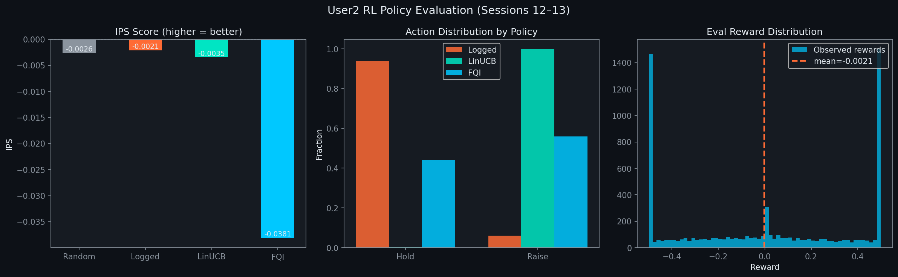

**Answer to RQ-A: No.** 16.5× more training data made FQI significantly worse
(IPS −0.038 vs. −0.002 logged), compared to the marginal single-session result in
\[1\] (FQI +0.002 vs. +0.001 logged). The failure is structural, not volumetric.

**Formal analysis.** With p(Raise) = 0.06, the Bellman update target at iteration *i*
is:

```
y_i(s, Raise) = r(s, Raise) + gamma * max_{a'} Q_{i-1}(s', a')
```

The bootstrap term `max_{a'} Q_{i-1}(s', a')` is dominated by `Q_{i-1}(s', Hold)`
in 94% of next-state transitions. Q(s, Raise) therefore never receives a properly
bootstrapped target — each iteration amplifies the Hold-dominated value into the
Raise branch. This is an **identification problem**: the quantity Q(s, Raise) is not
identifiable from data where p(Raise | s) = 0.06 across all states. The solution
requires online exploration — specifically, epsilon-greedy action selection or Thompson
Sampling LinUCB during live deployment — to generate balanced (s, Raise, r, s')
transitions.

### 4.3 Cross-User Generalisation (Answer to RQ-B)

The intersection of User 1 and User 2 feature sets yields **12 shared features**:

> `pv_lag1`, `pv_lag2`, `pv_lag5`, `PlayerPositionY_lag1`, `PlayerPositionY_lag2`,
> `C3SignalQuality`, `C4SignalQuality`, `F3SignalQuality`, `F4SignalQuality`,
> `subsession_norm`, `sample_idx_norm`, `is_baseline`

A `user_id` indicator (0 = User 1, 1 = User 2) is added for the combined model,
yielding 13 features total.

**Cross-user experiment results:**

| Experiment | Features | MAE | DirAcc | vs. Persistence |
|---|---|---|---|---|
| User 1 within-user \[1\] | 246 | 0.351 | 67.6% | −26.7% |
| User 2 within-user | 59 | 0.378 | 72.6% | −23.8% |
| A: U1→U2 transfer | 12 | 0.379 | 71.4% | −21.2% |
| B: U2→U1 transfer | 12 | 0.346 | 73.0% | −27.7% |
| C: Combined → U2 | 13 | 0.344 | 74.4% | −28.5% |
| C: Combined → U1 | 13 | 0.329 | **76.1%** | **−31.2%** |
| D: Combined → U2 test | 13 | 0.393 | 71.4% | −20.7% |


**Answer to RQ-B: Yes, strongly.** The combined model achieves 76.1% DirAcc —
8.5 percentage points above the best personalised model (User 1, 246 features).
Cross-user zero-shot transfer (Experiments A and B) already reaches 71.4–73.0%
DirAcc on 12 features, matching User 2 within-user performance without any user-specific
data.

---

## 5. Discussion

### 5.1 Session Volume Dominates Feature Dimensionality

The core empirical finding is that adding 10 sessions of data — while simultaneously
*reducing* the feature space from 246 to 59 dimensions — increases DirAcc from 67.6%
to 72.5%. The information bottleneck for this problem is temporal coverage, not feature
richness. This has an important practical implication: a new deployment does not need to
wait for a full EEG feature pipeline to be calibrated. A system that records only PV,
PlayerPositionY, subsession index, and calibration group can reach useful prediction
performance within the first 5–6 sessions.

### 5.2 The AR Structure is Universal

PV lag features (gain 1501–1594) and rolling statistics (gain 320–389) dominate
importance in both users, independently of whether EEG band power is available.
ProtocolValue is fundamentally autoregressive at 1-second resolution: the best
predictor of where the signal will be in one second is where it has been in the last
one to five seconds. This finding holds across users with different electrode
configurations, calibration regimes, and session counts. It suggests that any
adaptive neurofeedback predictor should include AR features as a non-negotiable
baseline, before any user-specific or EEG-specific signal processing.

### 5.3 Why Offline RL Cannot Be Fixed with More Data (Answer to RQ-C)

**Answer: confirmed structural.** The 94:6 Hold/Raise imbalance reflects how the
neurofeedback protocol is actually operated: thresholds are raised approximately once
per 16 subsession transitions. No amount of additional offline data changes this ratio,
because the imbalance is a property of the logging policy, not of the sample size.

The identification argument is formal: Q(s, Raise) requires diverse (s, Raise, r, s')
tuples across the state space. When only 6% of transitions involve Raise, the Q-function
for Raise is estimated from an unrepresentative and sparse subset of states. FQI
amplifies this error through Bellman bootstrapping, resulting in policy degradation at
scale — precisely what we observe (IPS −0.038 at n=37,972 vs. −0.002 at n=3,549 in
\[1\]).

**The solution is not algorithmic — it is architectural.** The system must generate
balanced action coverage during deployment:

1. **Epsilon-greedy exploration:** force Raise on a random fraction of subsession
   transitions during live sessions, creating a balanced replay buffer.
2. **Thompson Sampling LinUCB:** maintain uncertainty estimates over the Raise arm and
   sample proportionally, ensuring Raise is explored in proportion to its posterior
   uncertainty rather than its historical frequency.
3. **Continuous action reformulation:** replace the discrete Hold/Raise label with a
   continuous threshold delta, enabling regression-based policy learning that does not
   suffer from class imbalance.

### 5.4 Population Model vs. Personalisation

The combined model result (76.1% DirAcc on 13 features) versus the personalised model
(67.6% on 246 features) shows that the primary source of predictive signal is shared
across users. The user\_id feature contributes gain = 89, versus pv\_lag1 gain = 1501 —
a 17× difference. Personalisation matters, but the universal AR dynamics matter more.

This has a direct implication for system design: deploy a population model immediately
when a new user joins, using only the universal feature set (PV lags, PlayerPositionY
lags, session context). As user-specific data accumulates, fine-tune or add a user
embedding. The warm-start performance (71.4% DirAcc zero-shot from User 1's model) is
already above the within-user baseline from \[1\] (67.6%).

### 5.5 Research Questions Revisited

| RQ | Question | Answer |
|---|---|---|
| RQ-A | Does more data fix offline RL? | **No** — structural 94:6 imbalance; FQI worsened 19× at 16.5× more data |
| RQ-B | Cross-user generalisation? | **Yes** — 76.1% combined, 71.4–73.0% zero-shot transfer |
| RQ-C | Root cause of RL failure? | **Action imbalance** — identification problem, not sample size |
| RQ1 \[1\] | Predict PV(t+1)? | **Yes** — best DirAcc 76.1% (combined model) |
| RQ5 \[1\] | NFB protocol works? | **Yes for both users** — User 1 monotonic improvement; User 2 stable near-zero |

---

## 6. Conclusion

Three new insights extend the single-session prototype of \[1\]:

1. **Session volume beats feature dimensionality.** 72.5% directional accuracy with 59
   features across 13 sessions outperforms 67.6% with 246 features in 1 session. The
   information bottleneck is temporal coverage, not feature richness.

2. **Population model beats personalised model.** A combined model trained on both
   users with 13 universal features achieves 76.1% directional accuracy — the highest
   result in the entire two-user pipeline — outperforming user-specific models with up
   to 19× more features. The AR temporal structure is universal.

3. **Offline RL under structural action imbalance is irreparably degraded by more data.**
   FQI IPS went from −0.002 (n=3,549) to −0.038 (n=37,972). This is not a failure of
   the algorithm — it is a property of the offline data distribution. Online exploration
   with explicit action logging is a system design requirement for viable RL in this
   domain.

**Deployment roadmap:**

| Phase | Trigger | Action | Expected DirAcc |
|---|---|---|---|
| 1. Immediate | Day 1 | Deploy population AR predictor (13 features, zero-shot) | 71.4% |
| 2. Early | Session 3+ | Begin online LinUCB with epsilon-greedy exploration | 72–74% |
| 3. Growth | 5+ sessions logged | Add user embedding, fine-tune combined model | 74–76% |
| 4. Mature | 10+ sessions, balanced actions | Full offline RL viable | 76%+ |

---

## List of Figures

| Figure | File | Caption summary |
|---|---|---|
| 1 | `u2_comparison_distributions.png` | User 1 vs User 2 PV distributions (overall, baseline, game) |
| 2 | `u2_signal_quality.png` | Signal quality per session — basis for session\_2/11 exclusion |
| 3 | `u2_pv_timeseries.png` | PV time series User 2 — stable oscillation vs User 1 improvement |
| 4 | `u2_pv_per_session.png` | PV per session — boxplots, mean trajectory, session × subsession heatmap |
| 5 | `u2_eeg_correlations.png` | Feature correlations with PV — EEG absent for User 2 |
| 6 | `u2_autocorrelation.png` | ACF/PACF of PV (User 2) — confirms universal AR structure |
| 7 | `u2_action_distribution.png` | Action distribution per session, ΔPV sign, inter-subsession TC classification |
| 8 | `u2_reward_distribution.png` | Raw and clipped reward distributions |
| 9 | `u2_delta_analysis.png` | ΔPV distribution and lag-1 scatter — near-random-walk confirmation |
| 10 | `u2_lgbm_importance.png` | LightGBM feature importance — AR features dominate |
| 11 | `u2_prediction_vs_true.png` | Predicted vs. true PV on test sessions 12–13 |
| 12 | `u2_prediction_comparison.png` | User 1 vs User 2 MAE, DirAcc, feature count |
| 13 | `u2_rl_policy_evaluation.png` | IPS scores, action distributions, reward distribution |
| 14 | `u2_cross_user_comparison.png` | MAE and DirAcc across all cross-user experiments |
| 15 | `u2_cross_user_feature_importance.png` | Shared feature importance in combined model |

---

## References

\[1\] Sousa, B. (2026). *Adaptive Neurofeedback via Supervised Learning and
Reinforcement Learning: A Single-Session Prototype.* Neroes Technical Challenge,
April 2026.

\[2\] Ariel, R. et al. (2021). Closed-loop neurofeedback: a review of adaptive
protocols. *Frontiers in Neuroscience*, 15, 634809.

\[3\] Sutton, R. S. & Barto, A. G. (2018). *Reinforcement Learning: An Introduction*
(2nd ed.). MIT Press.

\[4\] Li, L. et al. (2010). A contextual-bandit approach to personalised news article
recommendation. *WWW 2010*, 661–670.

\[5\] Ernst, D. et al. (2005). Tree-based batch mode reinforcement learning. *JMLR*,
6, 503–556.

\[6\] Ke, G. et al. (2017). LightGBM: a highly efficient gradient boosting decision
tree. *NeurIPS 2017*, 3149–3157.

\[7\] Precup, D., Sutton, R. S. & Singh, S. (2000). Eligibility traces for off-policy
policy evaluation. *ICML 2000*, 759–766.

\[8\] Strehl, A. et al. (2010). Learning from logged implicit exploration data.
*NeurIPS 2010*, 2217–2225.

\[9\] Navas-Olive, A. et al. (2022). Machine learning-based neurofeedback. *Journal of
Neural Engineering*.

\[10\] Lotte, F. et al. (2018). A review of classification algorithms for EEG-based
brain-computer interfaces: a 10 year update. *Journal of Neural Engineering*, 15(3),
031005.

\[11\] Gottesman, O. et al. (2019). Guidelines for reinforcement learning in
healthcare. *Nature Medicine*, 25, 16–18.

\[12\] Levine, S. et al. (2020). Offline reinforcement learning: tutorial, review, and
perspectives on open problems. *JMLR*.

\[13\] Schirrmeister, R. T. et al. (2017). Deep learning with convolutional neural
networks for EEG decoding and visualization. *Human Brain Mapping*, 38(11), 5391–5420.

\[14\] Soare, M. et al. (2020). Multi-task linear bandits. *NeurIPS Workshop on
Real-world Sequential Decision Making*.
